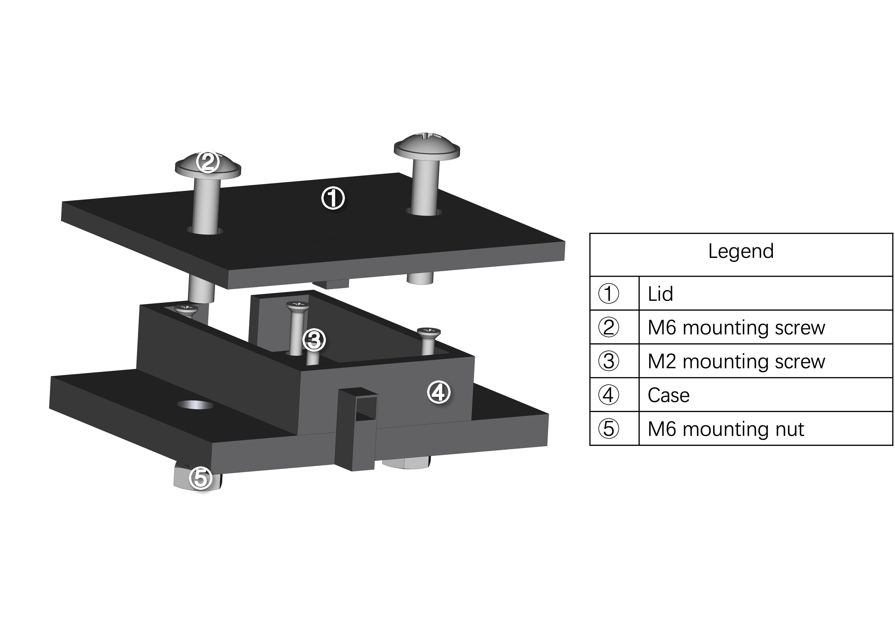

# AdafruitUltimateGPS

Julia language interface to communicate with the Adafruit Ultimate GPS sensor

## Sensor


The [Adafruit Ultimate GPS](https://www.adafruit.com/product/4279) device is GPS module that communicates NMEA messages via RS232. 

### Sensor Housing


The  housing was printed using ASA plastic. Inserts were added post print by widening the bottom holes with sodder.

## Installation

```julia
pkg> add https://github.com/mdp-aerosol-group/AdafruitUltimateGPS.jl.git
```

The package depends on LibSerialPort. Ensure that the user has access to the ports by adding the user to the dialout group.

```bash
sudo usermod -a -G dialout $USER
```

## Example Usage

No functions are exported by the module to avoid potential namespace collision with other devices. Thus all function calls are prefaced by AdafruitUltimateGPS. 

```julia
using AdafruitUltimateGPS

# Check for the correct port running list_ports() first
port = AdafruitUltimateGPS.config("/dev/ttyUSB0")

# This streams the raw data from the port to a data file
# This function should only be called once
@async AdafruitUltimateGPS.stream(port, "foo.txt")

# Retrieve the current NMEA Message from the current data buffer. 
# This call can be used for real-time logging. 
data = AdafruitUltimateGPS.get_current_RMC()
```

## Acknowledgements

This work was supported by EPA grant #84042701.
